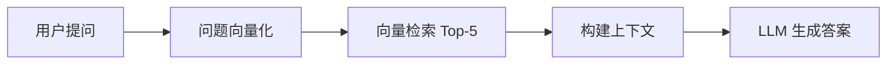

# RAG 智能文档问答系统

基于 Retrieval-Augmented Generation (RAG) 技术构建的智能文档问答机器人。

## 🌟 功能特性

- 📄 支持多格式文档（TXT、Markdown）
- 🔍 智能文档检索与精准问答
- 💬 SSE 流式响应输出，实时显示答案
- 🎨 现代化暗色主题 UI 设计
- ⚡ 指数退避重试机制，提升稳定性
- 🚀 已部署到腾讯云 EdgeOne，可在线体验

## 🛠️ 技术栈

| 层 | 技术 |
|----|------|
| 前端 | Vue 3 + Vite + Pinia + Vue Router |
| 后端 | Node.js + Express |
| 大模型 | 智谱 GLM-4-Flash |
| 向量存储 | 本地 JSON 文件（开发环境）|
| 部署平台 | 腾讯云 EdgeOne（静态托管 + 云函数）|
| 安全 | DOMPurify XSS 防护 |

## 🚀 快速开始

### 环境要求

- Node.js >= 18.0.0
- npm >= 9.0.0

### 本地开发

```bash
# 安装后端依赖
npm install

# 安装前端依赖
cd frontend && npm install

# 启动后端服务（终端 1）
npm start

# 启动前端开发服务器（终端 2）
cd frontend && npm run dev
```

访问 http://localhost:5173 查看应用

### 在线演示

项目已部署到腾讯云 EdgeOne：
- 前端：EdgeOne 静态托管
- API：EdgeOne 云函数
- 文档：预置在 `docs/` 目录

## 📝 核心功能实现

### RAG 工作流程

#### 开发环境（完整 RAG）

```
1. 文档上传 → 文档解析 → 文本分割 → 向量化 → 存入向量数据库
2. 用户提问 → 问题向量化 → 余弦相似度检索 → Top-K 相关文档
3. 构建 Prompt → 调用 LLM → 流式返回答案
```

**关键技术点**：
- ✅ 真正的向量检索（余弦相似度）
- ✅ 混合检索策略（向量 60% + 关键词 40%）
- ✅ Rerank 重排序优化
- ✅ 会话历史管理（多轮对话）

#### 生产环境（EdgeOne 云函数 - 完整 RAG）

**好消息！已实现真正的向量检索！**



**技术实现**：
- ✅ 预计算文档向量并打包到云函数
- ✅ 使用余弦相似度进行向量检索
- ✅ 真实的相似度分数（非随机）
- ✅ 降级策略：失败时自动切换到全文检索
- ✅ 完全免费，无需额外服务

**性能**：
- 首次请求：~2秒（加载向量数据）
- 后续请求：~1秒（向量检索 + AI 对话）
- 支持 12+ 文本块的高效检索

**生产环境优化建议**：
- 使用腾讯云 VectorDB 实现真正的向量检索
- 使用 COS 对象存储支持文档上传
- 使用 Redis 管理会话状态

### 错误处理机制

- ✅ 指数退避重试（网络错误、超时、限流）
- ✅ 状态码判断（4xx 不重试，5xx 重试）
- ✅ 请求超时处理
- ✅ SSE 心跳包防止代理断开

## 📄 版权

© 2026. 本项目仅供展示用途。